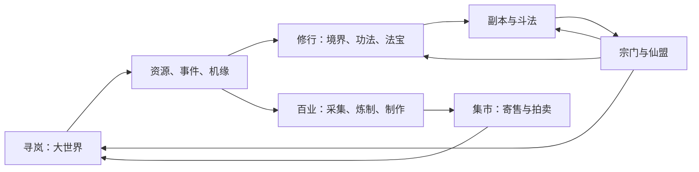

# 《寻岚记》游戏板块与功能架构草案 v0.1

## 0. 设计结论

《寻岚记》不应把“修仙”拆成许多互不相关的日常入口。游戏的全部核心板块都要回答同一个问题：**玩家在这个会变化的大世界里，如何观察岚、承担风险、获得自己的机缘，并让这段经历留下可被他人看见的痕迹？**

因此采用“**五个常驻入口 + 三类场景入口**”的信息架构。常驻入口让玩家随时处理成长与社交；场景入口只在玩家抵达对应地点或触发条件后出现，避免首页堆满按钮。



这里的循环意味着：

- 地图不是赶路背景，而是资源、风险、社交和故事的发生地。
- 随机机缘不是无来源的抽奖；它由地点、岚象、时令、NPC 状态和玩家行为触发。
- 宗门不是单纯公会；它是玩家在世界中的职业、声望、权限和后果。
- 交易、斗法和副本都消耗或产出真实的世界资源，因此不会变成孤立小游戏。

## 1. 信息架构：玩家真正看见的板块

### 五个常驻入口

| 入口 | 玩家要解决的问题 | 核心内容 | 不是它的职责 |
|---|---|---|---|
| **寻岚** | 现在去哪、哪里有变化、我能发现什么？ | 世界地图、区域岚象、可见事件、探索线索、地图图鉴、传送 | 不替代任务清单或角色养成面板 |
| **修行** | 我怎么变强、下一步缺什么？ | 境界、功法、术法、法宝、经脉/道基、突破准备、战斗配置 | 不直接承担交易和宗门管理 |
| **行囊** | 我拿到了什么、能怎么用？ | 背包、装备、材料、丹药、符箓、法宝、灵兽、配方、图鉴 | 不把所有制作功能塞进背包 |
| **宗门** | 我属于哪里、能做什么、要承担什么？ | 世界宗门身份、门规、职位、贡献、差事、宗门研究；玩家仙盟页签 | 不把好友、交易和队伍管理混在这里 |
| **同道** | 我如何与其他玩家合作、竞争或交换？ | 好友、队伍、聊天、附近修士、师徒/道侣（后续）、寄售行、拍卖行、邮件 | 不让社交成为强制养成门槛 |

### 三类场景入口

| 场景入口 | 出现场所 | 作用 | 说明 |
|---|---|---|---|
| **洞府** | 玩家私有栖身处/城镇入口 | 仓储、陈设、药圃、炼制台、休整、个人陈列 | 首发只做“小洞府”，不做重度家园装修 |
| **事务簿** | 右侧快捷按钮/各地告示牌 | 主线引导、委托、宗门差事、周目标、赛季线索 | 任务是引导和信息汇总，不应绑死探索路线 |
| **斗法场** | 城镇论道台、野外争夺点、宗门战入口 | 友好切磋、匹配竞技、资源冲突、宗门战 | 不允许在安全城镇随意骚扰新手 |

## 2. 七个产品板块：功能、循环和首发边界

### A. 寻岚：开放大世界与探索板块

这是《寻岚记》的第一板块。玩家打开它时，不是看到“每日任务”，而是看到一张持续变化的修仙世界地图。

**核心子系统**

1. **区域岚象**：显示雾、雨、风、热、潮汐、人为扰动等局部灵性天气。只展示已被观察或被他人传闻的状态，保留未知。
2. **探索线索**：NPC 口述、残碑、灵兽异常、药材生长、商队路线、宗门告示会组成线索。线索可真假并存，但绝不凭空出现。
3. **资源点**：基础资源公开且有节律；稀有资源由区域状态和竞争事件决定；个人机缘为每人独立结算。
4. **副本入口**：固定境界副本一直可见；动态副本满足条件后出现；个人奇遇副本只对触发者或其受邀小队开放。
5. **地图声望**：不是强制刷数值，而是记录玩家对某地的熟悉度，解锁更可靠的线索、采集判断和 NPC 关系。

**首发可做**：雾隐原 1 张大地图、3 个稳定资源区、1 个固定炼气副本、3 条动态副本触发链、8 类世界事件。

**后续扩展**：五图生态、跨地图商路、区域灾变、遗址长期演化、资料片世界事件。

### B. 修行：境界、功法、术法与法宝

修行必须有清晰的传统晋阶感，但不能只靠点击升级。建议仍以“炼气 → 筑基 → 结丹 → 元婴……”作为大境界基底；每次突破由**修为、感悟、材料、心境事件、突破环境**共同构成。

**核心子系统**

- **境界与小境界**：给出成长门槛和地图/副本准入，不用战力数字强行封锁所有探索。
- **功法流派**：玩家可选主修路线，例如御器、符箓、丹术、身法、阵理；这不是传统职业锁定，允许以消耗和学习成本转修。
- **术法配置**：战斗时携带有限主动术法、身法/防御、法宝技和一个“应变位”，形成 2D 动作战斗的配装决策。
- **法宝**：每件法宝有来历、器型、主效、祭炼路线、可交易状态和外观卡；极品来自内容与构筑，而不是单一抽取。
- **灵兽/灵宠**：优先作为探索与战斗伙伴，包含捕获、培养、羁绊、派遣；不在首发做几十层随机强化。
- **突破**：突破失败不能导致账号退步；可转化为悟性、残缺材料或新的奇遇线索，保持风险但避免挫败。

**首发可做**：炼气前/中/后期、3 条功法方向、12 个术法、6 件可祭炼法宝、8 种可收服灵兽、筑基作为版本终点预告。

### C. 百业：资源、炼制与玩家供给

百业把探索收益转化成市场商品。为了手机版可控，首发不建议同时开放炼丹、炼器、制符、阵法、种植五条完整深度生产线。

**首发三业**

| 百业 | 从哪里来 | 做什么 | 与其他板块的连接 |
|---|---|---|---|
| 采药与炼丹 | 药园、山谷、动态雨雾事件 | 回复、辅助、突破辅材 | 地图岚象、宗门药园、拍卖行 |
| 采矿与炼器 | 矿脉、遗址、精英怪 | 法宝胚子、装备部件、修理材料 | 世界 BOSS、固定副本、法宝祭炼 |
| 制符与阵具 | 残卷、商路、秘境 | 单次战术道具、探索工具、队伍辅助 | PVP 配装、动态副本、宗门研究 |

**设计原则**：每一业都要有“自用底线、专精上限、交易价值”。所有玩家能做基础消耗品；愿意研究配方、品质和地图条件的人，才能形成市场身份。

### D. 宗门：世界身份、职位与后果

沿用已确定的“双层组织”设计：

- **世界宗门**：NPC 主导的正式势力。玩家只能有一个主世界宗门，可以从记名/外门开始升任内门、真传、执事、堂主/护法、议事席轮值。
- **玩家仙盟**：玩家创建的社交组织。可同时加入一个仙盟，不替代世界宗门。

**宗门页的五个页签**：`身份`、`门规`、`差事`、`贡献与研究`、`人物与关系`。

宗门差事不应是统一的十次跑环，而应根据身份变化：外门做采办/巡查/求援，执事负责派遣和资源调度，轮值高位参与有限的政策投票和驻地建设。正常退门可自由进行；只有触犯玩家事先能看到的严重门规，才会产生范围有限、可赎罪的通缉。

### E. 同道与集市：合作、信息与经济

**同道**包含：好友、附近修士、队伍、聊天、组队招募、师徒（后续）、邮件、黑名单与举报。

**集市**是独立的经济子板块，提供两种不同体验：

- **寄售行**：标准材料、丹药、符箓、可交易装备，以一口价为主，适合快速流通。
- **拍卖会**：稀有法宝、极品灵兽、洞府陈设、特殊配方，定时竞价，配合保证金、价格区间、成交记录和手续费。

经济的安全底线：物品来源、货币、拍卖成交、稀有奖励和 PVP 结算必须由服务端权威记录；绑定、可交易、限时交易、宗门归属四种状态要在物品卡上明确展示。

### F. 副本与世界事件：固定保障 + 有因果的随机

**固定境界副本**解决稳定成长：每个副本有建议境界、队伍人数、保底产出、首通故事和可重复的材料目标。

**动态副本**提供“这次是我的经历”：采用“地点锚点 + 岚象触发 + 人为/生灵扰动 + 人工模板 + 有限变体 + 境界层”的生成方式。例：连雨后，雾隐原的水蚀洞暴露；若附近商路受阻，洞中可能出现失散镖队、被惊动的水属妖兽或走私者，三者带来不同选择与奖励。

**世界事件**用于自然社交：灵兽迁徙、药潮、山火、商队遇险、宗门征召、遗址现世。参与人数可以很多，但结算应兼顾贡献、职业和个人线索，避免只奖励最后一击。

### G. 斗法：从切磋到有边界的竞争

斗法不是单一“战力榜”，而是四层递进：

1. **论道切磋**：双方同意，城镇和宗门内可进行；无资源损失。
2. **问剑台**：匹配 1v1 或 3v3，采用境界/配装分层与赛季段位；奖励以外观、称号、战术材料为主，避免压制成长。
3. **资源争夺**：只在清晰标识的野外争夺区发生，围绕矿脉、遗址、商路等短周期目标；低境界玩家有保护和撤离路线。
4. **宗门战**：长期版本再开放。以驻地、护送、阵眼和情报为目标，不做无限制野外杀戮。

## 3. 首发导航草图

```text
┌──────────────────────────────────────────────┐
│ 区域岚象 / 小地图 / 当前线索 / 附近事件             │
│                                              │
│                2D 大世界行动区                  │
│                                              │
│ [寻岚] [修行] [行囊] [宗门] [同道]                │
│       [事务簿] [集市] [洞府] [斗法]              │
└──────────────────────────────────────────────┘
```

移动端建议“常驻五入口”固定在底部；`事务簿`、`集市`、`洞府`、`斗法`放在可展开的二级栏。地图本身始终保持最大可视面积，不能被功能按钮遮住。

## 4. 版本切分：先让一件事好玩，再扩大世界

| 层级 | 必须交付 | 暂不做/后置 |
|---|---|---|
| **MVP（雾隐原）** | 探索、岚象、采药/炼丹、炼气成长、术法战斗、1 固定 + 3 动态副本、2 世界宗门、基础组队/聊天、寄售行、论道切磋 | 完整洞府装修、跨服、宗门战、灵兽繁殖、五类百业 |
| **首发版本** | 五地图、三百业、拍卖会、灵兽、筑基内容、问剑台、玩家仙盟、宗门贡献/研究 | 大规模领地战、自由 PK 常态化、结婚/子嗣等强关系系统 |
| **长期版本** | 结丹及以上、宗门战、商路与区域灾变、洞府扩建、赛季世界事件、跨服生态 | 不承诺无上限内容；每次扩张均需验证经济与服务器承载 |

## 5. 这套板块与参考游戏的差异

可借鉴的只是成熟 MMO 的功能分层：组织有共同成长，城镇聚合高频入口，副本/交易/生活/PVP 要形成闭环。公开资料显示，《问道》将宠物、任务、副本、竞技、BOSS、帮派和集市等分层；其帮派还包含建设、职位与共同研究。 [问道官方资料站](https://wd.leiting.com/home/game/game_data_list.php) [帮派介绍](https://wd.leiting.com/home/game/game_data.php?level=2&level_id=85&show_type=1)

《一念逍遥》将宗门、镇妖塔、论剑台等入口聚集于城镇，并用秘境、古宝、宗门与 PK 形成修仙日常；《寻岚记》借鉴的是“入口层级清晰”的方法，核心体验改为可观察的岚象与个人机缘。 [一念逍遥官方介绍](https://xian.leiting.com/news/1.html)

《新天龙八部》资料站并列帮会、交易市场、资源争夺、生活技能与副本，这说明 MMO 需要完整的成长、经济、社交和竞争链条；《寻岚记》将以区域岚象和地图事件把它们串成一条世界循环。 [新天龙八部官方资料站](https://www.tl.changyou.com/data/index.shtml)

本草案不使用上述作品的角色、剧情、专有名称、数值、界面或美术表达。

## 6. 下一轮需要共同确认的三个问题

1. 首发战斗更偏“2D 俯视角实时动作”还是“2D 横版即时战斗”？这会决定术法数量、操作复杂度、PVP 和动画资产规格。
2. 玩家是否可以同时拥有“世界宗门 + 玩家仙盟”？本草案建议可以，避免社交组织与世界身份互相排斥。
3. 你是否接受首发只做三项百业（炼丹、炼器、制符），把阵法、种植和洞府深度经营放到后续？这能明显降低首发系统膨胀风险。
