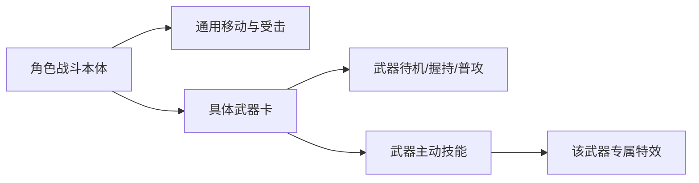

# 《寻岚记》角色与武器解耦原则 v0.1

## 正确关系

横版战斗不是“角色自带一套固定剑气”。正确资产关系如下：

- **角色本体**：脸、发型、服装、体型、移动、跳跃、受击；不预设剑气、火焰或任何武器技能。
- **武器卡**：必须先定义武器名称、器型、颜色、主材质、握持方式、稀有度、来历和可见识别物。
- **武器动作**：普通攻击、蓄力、连段、收招、切换与空中攻击；不同武器各自制作。
- **技能和特效**：隶属于该武器或该武器搭配的功法，不能先于武器定义。

## 当前样板角色的正确试片范围

当前“苍青剑修”只验证一件事：**横版 2D 人物本身好不好看、是否像同一位国漫角色、是否适合跑跳与战斗。**

本阶段只生成：

1. `A-01` 规范四视图；
2. `A-02` 炫酷主立绘；
3. `A-03` 表情页；
4. `M-01` 地图八方向小人；
5. `C-01` 横版战斗角色外观试片。

`C-01` 中的深青细剑只是为验证人物侧面轮廓留下的临时道具，不是已设计的武器，不产生攻击或特效。

## 武器卡确认后才开始的流程

1. 创作一张武器卡；
2. 生成武器四视图/独立图；
3. 生成角色持该武器的待机与基础攻击；
4. 定义该武器的连段、主动技能与法宝关系；
5. 为每个技能制作独立特效层；
6. 把武器和特效挂接到角色战斗骨骼/序列帧上。
